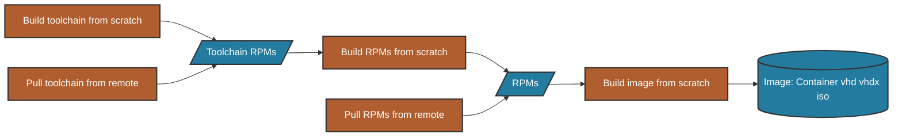
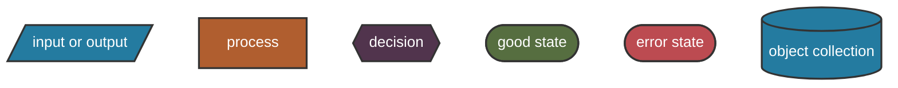
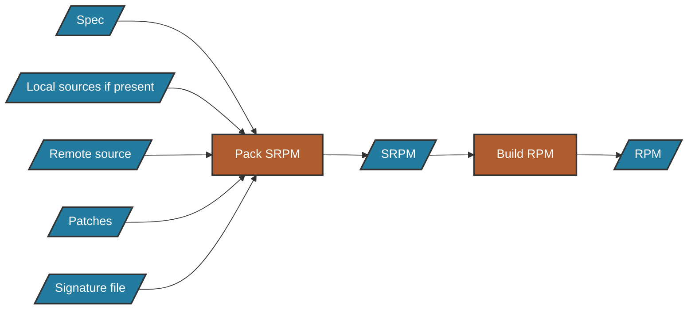

Azure Linux's build system is a sophisticated, multi-stage architecture built on Make and Go tools that transforms source specifications into bootable images. This page provides a high-level understanding of how the system operates.

## Architecture Components

The build system consists of three primary components:

<CardGroup cols={3}>
  <Card title="Tooling" icon="wrench">
    Makefiles, Go programs, Docker bootstrap environment, and chroot build environment
  </Card>
  <Card title="Package Generation" icon="box">
    SRPM creation, dependency resolution, and RPM building
  </Card>
  <Card title="Image Generation" icon="compact-disc">
    Filesystem composition, package installation, and image formatting
  </Card>
</CardGroup>

## Build Flow Overview

The complete build process follows this high-level flow:



<Accordion title="Diagram Key">
The flowcharts throughout this documentation use consistent color coding:



- **Blue**: Input/output files and collections
- **Brown**: Process steps
- **Purple**: Decision points
- **Green**: Success states
- **Red**: Error states
</Accordion>

## RPM Package Flow

Azure Linux is an RPM-based distribution. Each package is built from sources, patches, and a spec file, with signatures verifying source integrity:



## Make-Based System

The build system is based on **Make**, which tracks file dependencies and modification times to determine what needs rebuilding. This approach:

- Rebuilds targets only when dependencies change
- Works hierarchically with file-based dependencies
- Uses advanced patterns for folder dependencies and configuration tracking
- Splits logic across multiple `*.mk` files under `./scripts`

<Info>
**Key Advantage**: Make's dependency tracking ensures efficient rebuilds—only changed components are recompiled, saving significant build time in iterative development.
</Info>

## Build Targets

You can control the build process at different stages:

| Target | Description |
|--------|-------------|
| `make toolchain` | Build or download the toolchain RPMs |
| `make input-srpms` | Create source RPMs from local specs |
| `make build-packages` | Build all required packages |
| `make image` | Generate final disk images |
| `make iso` | Create bootable ISO installers |

## Build Modes

The system supports multiple build modes via Make variables:

<Tabs>
  <Tab title="Remote Toolchain">
    ```bash
    make image
    ```
    Downloads pre-built toolchain RPMs from remote servers (default, fastest)
  </Tab>
  <Tab title="Toolchain Archive">
    ```bash
    make image TOOLCHAIN_ARCHIVE=toolchain.tar.gz
    ```
    Extracts toolchain from a local archive
  </Tab>
  <Tab title="Full Bootstrap">
    ```bash
    make image REBUILD_TOOLCHAIN=y
    ```
    Builds everything from scratch using host system's Docker environment
  </Tab>
</Tabs>

## Clean Build Environment

All packages are built in isolated **chroot environments** populated with toolchain RPMs. This ensures:

- Reproducible builds across different host systems
- No interference from host system tools or libraries
- Consistent build environment matching the target OS
- Safe package building with automatic cleanup on errors

<Tip>
The chroot worker is an archive containing all toolchain RPMs installed into a minimal filesystem. Each package build extracts this archive into a fresh directory, providing complete isolation.
</Tip>

## Architecture Deep Dive

For detailed information about each component, see:

<CardGroup cols={2}>
  <Card title="Initial Preparation" icon="gear" href="./initial-prep">
    Makefiles, Go tooling, toolchain, and chroot environments
  </Card>
  <Card title="Local Packages" icon="file-code" href="./local-packages">
    SPEC files, source management, and SRPM creation
  </Card>
  <Card title="Package Building" icon="hammer" href="./package-building">
    Dependency graphing, fetching, and parallel building
  </Card>
  <Card title="Image Generation" icon="hard-drive" href="./image-generation">
    Image composition, package installation, and format conversion
  </Card>
  <Card title="Build Logs" icon="file-lines" href="./logs">
    Understanding and troubleshooting build errors
  </Card>
</CardGroup>

## Next Steps

<Card title="Initial Preparation Phase" icon="arrow-right" href="./initial-prep">
  Learn about the toolchain, Go tools, and build environment setup
</Card>
