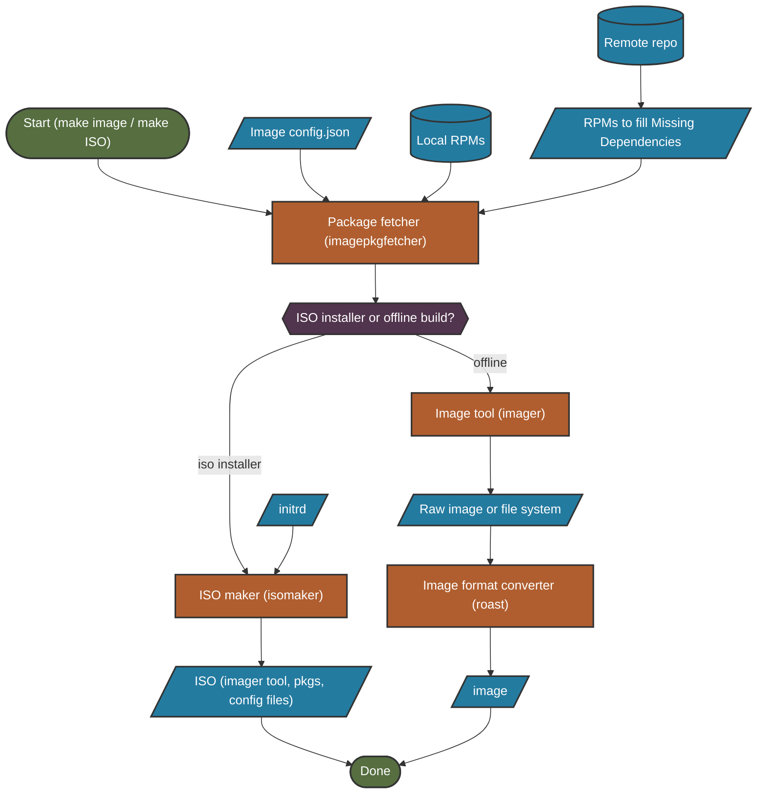

Image generation is the final stage of the build system, where packages are composed into bootable disk images or ISO installers based on configuration files.

## Image Generation Overview

The image generation process transforms packages into usable outputs:

<CardGroup cols={3}>
  <Card title="Configuration" icon="file-code">
    JSON files define partitions, packages, and settings
  </Card>
  <Card title="Composition" icon="layer-group">
    Install packages into a filesystem
  </Card>
  <Card title="Formatting" icon="compact-disc">
    Convert to VHD, VHDX, ISO, or other formats
  </Card>
</CardGroup>

## Complete Image Build Flow



## Configuration Files

Image generation is entirely driven by configuration files that define:

- **Image format** - VHD, VHDX, ISO, container, etc.
- **Disk layout** - Partition sizes, filesystems, mount points
- **Boot configuration** - Bootloader, kernel parameters, UEFI/BIOS
- **Package composition** - Which packages to install
- **Customization** - Users, services, files, scripts

<Info>
For complete configuration file format documentation, see [Image Configuration Format](../formats/imageconfig).
</Info>

## Default Image Configurations

The toolkit includes several pre-built configurations in `./imageconfigs/`:

<Tabs>
  <Tab title="core-efi.json (default)">
    **Gen-2 Hyper-V compatible**
    
    - Creates `core.vhdx` image
    - UEFI boot support
    - Basic system with essential packages
    - Default for most builds
    
    ```bash
    make image
    # Uses ./imageconfigs/core-efi.json by default
    ```
  </Tab>
  
  <Tab title="core-legacy.json">
    **Gen-1 Hyper-V compatible**
    
    - Creates `core.vhd` image
    - Legacy BIOS boot
    - For older VMs and hardware
    
    ```bash
    make image CONFIG_FILE=./imageconfigs/core-legacy.json
    ```
  </Tab>
  
  <Tab title="Custom Configs">
    **Your own configurations**
    
    - Define custom partitioning
    - Select specific package sets
    - Configure users and services
    
    ```bash
    make image CONFIG_FILE=./path/to/myconfig.json
    ```
  </Tab>
</Tabs>

## Stage 1: Configuration Validation

The `imageconfigvalidator` tool validates configuration files before any build work begins.

### What Gets Validated

<AccordionGroup>
  <Accordion title="Structural Validation">
    - Valid JSON syntax
    - Required fields present
    - Field types correct
    - No unknown fields
  </Accordion>
  
  <Accordion title="Disk Layout Validation">
    - Partition sizes are valid
    - Partitions fit within disk size
    - Filesystem types are supported
    - Mount points are valid
  </Accordion>
  
  <Accordion title="Package Validation">
    - Package names are valid
    - No conflicting packages
    - Required packages present (kernel, bootloader, etc.)
  </Accordion>
  
  <Accordion title="Bootloader Validation">
    - Boot configuration is valid
    - Kernel parameters are reasonable
    - UEFI/BIOS settings consistent with partitioning
  </Accordion>
</AccordionGroup>

<Tip>
Run validation manually with:
```bash
imageconfigvalidator --input=myconfig.json
```
</Tip>

## Stage 2: Package Resolution

The `imagepkgfetcher` tool gathers all packages needed for the image.

### Package Sources

Similar to `graphpkgfetcher`, this tool searches multiple sources:

<Steps>
  <Step title="Local Built Packages">
    RPMs built during the build-packages stage in `./../out/RPMS/`
  </Step>
  <Step title="Cached Packages">
    Previously downloaded packages in the RPM cache
  </Step>
  <Step title="Remote Repositories">
    Official Azure Linux package servers (unless `DISABLE_UPSTREAM_REPOS=y`)
  </Step>
  <Step title="Custom Repositories">
    Additional repos specified in `REPO_LIST`
  </Step>
</Steps>

### Dependency Resolution

For each package listed in the config:

1. Find the package in available sources
2. Determine all runtime dependencies recursively
3. Download missing packages from remote repos
4. Cache all packages locally for image composition

<Warning>
Unlike package building, image generation only needs **runtime** dependencies. Build dependencies are not included in the final image.
</Warning>

## Stage 3: Image Composition (Imager)

The `imager` tool creates the actual filesystem and installs packages using a chroot environment.

### Image Composition Process

<Steps>
  <Step title="Create Disk Structure">
    - Allocate raw disk image or directory
    - Create partition table (GPT or MBR)
    - Format partitions with specified filesystems
    - Set up mount points
  </Step>
  
  <Step title="Initialize Filesystem">
    - Create basic directory structure (`/etc`, `/usr`, `/var`, etc.)
    - Set up device nodes (`/dev`)
    - Configure initial system files
  </Step>
  
  <Step title="Install Packages">
    - Mount disk as loopback device (for raw images)
    - Use RPM to install packages into filesystem
    - Resolve dependencies and install in correct order
    - Run post-installation scripts
  </Step>
  
  <Step title="Configure System">
    - Set up users and groups
    - Configure networking
    - Enable/disable services
    - Install custom files
    - Run custom scripts
  </Step>
  
  <Step title="Install Bootloader">
    - Install GRUB or other bootloader
    - Generate boot configuration
    - Set up kernel and initramfs
    - Configure boot parameters
  </Step>
  
  <Step title="Finalize">
    - Set file permissions
    - Create necessary symlinks
    - Unmount filesystems
    - Clean up temporary files
  </Step>
</Steps>

### Raw Image vs Directory

The imager can produce two types of output:

<Tabs>
  <Tab title="Raw Disk Image (*.raw)">
    **Full disk image** with partitions
    
    - Contains partition table
    - Bootloader installed in MBR/ESP
    - Mounted as loopback device during composition
    - Converted to final format by roast tool
    
    **Use for:** VHDs, VHDXs, bootable ISOs
  </Tab>
  
  <Tab title="Directory Tree">
    **Filesystem only**, no partitions or bootloader
    
    - Just the filesystem contents
    - No partition table or bootloader
    - Directly accessible as a directory
    
    **Use for:** Container images, chroot environments, initrd
  </Tab>
</Tabs>

<Info>
The imager uses the chroot worker environment to properly handle RPM installations and post-install scripts, ensuring packages are configured correctly for the target system.
</Info>

## Stage 4: Format Conversion (Roast)

The `roast` tool converts raw disk images into final output formats.

### Supported Output Formats

<CardGroup cols={2}>
  <Card title="VHD" icon="hard-drive">
    **Virtual Hard Disk**
    
    - Hyper-V Gen-1 VMs
    - Azure (older)
    - Fixed or dynamic allocation
  </Card>
  
  <Card title="VHDX" icon="hard-drive">
    **Virtual Hard Disk v2**
    
    - Hyper-V Gen-2 VMs
    - Azure (current)
    - Better performance and features
  </Card>
  
  <Card title="QCOW2" icon="hard-drive">
    **QEMU Copy-On-Write**
    
    - KVM/QEMU virtual machines
    - OpenStack
    - Efficient storage
  </Card>
  
  <Card title="RAW" icon="file">
    **Raw Disk Image**
    
    - Universal format
    - No overhead
    - Large file size
  </Card>
</CardGroup>

### Conversion Process

```bash
# Roast takes a raw image and produces the final format
roast --input=image.raw --output=image.vhdx --format=vhdx
```

The conversion process:
- Preserves partition layout and data
- Converts bootloader as needed
- Optimizes for target format
- Validates output integrity

## ISO Installer Builds

ISO builds are different from standard images—they create bootable installers that can deploy images to target computers.

### ISO Components

<Tabs>
  <Tab title="Initrd/Initramfs">
    **RAM-based root filesystem**
    
    - Boots from memory
    - Contains installer application
    - Includes necessary drivers and tools
    - Two versions available:
      - **GUI**: Calamares-based graphical installer
      - **Terminal**: Text-based installer
  </Tab>
  
  <Tab title="Installation Payload">
    **The actual image to install**
    
    - Complete package set
    - Pre-configured image
    - Compressed for size
    - Extracted during installation
  </Tab>
  
  <Tab title="Boot Configuration">
    **ISOLINUX/GRUB configuration**
    
    - Boot menu
    - Kernel parameters
    - Initrd loading
    - UEFI and BIOS support
  </Tab>
</Tabs>

### Building ISOs

The ISO build process:

<Steps>
  <Step title="Build Initrd">
    - Uses a static configuration included with toolkit
    - Recursive Make call to build initrd image
    - Includes `liveinstaller` tool
    - Contains minimal package set for installation
  </Step>
  
  <Step title="Prepare Payload">
    - Build or gather target image packages
    - Include configuration files
    - Compress installation data
  </Step>
  
  <Step title="Create ISO (isomaker)">
    - Combine initrd, payload, and boot configuration
    - Create ISO 9660 filesystem
    - Make bootable for UEFI and BIOS
    - Generate checksum files
  </Step>
</Steps>

```bash
# Build ISO installer
make iso CONFIG_FILE=./imageconfigs/core-efi.json

# Or build with GUI installer (Calamares)
make iso CONFIG_FILE=./imageconfigs/core-efi.json INSTALLER_TYPE=gui
```

<Accordion title="Initrd Config Tracking">
Building the initrd requires a recursive Make call with a different `CONFIG_FILE`. Since many build system components depend on `CONFIG_FILE`, rebuilding the initrd invalidates cached state and triggers a brief rebuild.

This is expected behavior and ensures the initrd is built correctly for the target configuration.
</Accordion>

### Live Installer

The `liveinstaller` tool runs inside the ISO's initrd and is responsible for:

- Detecting target disks
- Partitioning and formatting disks
- Installing packages to target
- Configuring bootloader
- Applying customizations
- Running post-install scripts

It provides a streamlined installation experience, whether GUI or terminal-based.

## Distroless Images

Azure Linux supports distroless container images without an RPM database.

### RPM Manifest File

Distroless images include `/var/lib/rpmmanifest/container-manifest-2` containing the output of:

```bash
rpm --query --all --query-format "%{NAME}\t%{VERSION}-%{RELEASE}\t%{INSTALLTIME}\t%{BUILDTIME}\t%{VENDOR}\t%{EPOCH}\t%{SIZE}\t%{ARCH}\t%{EPOCHNUM}\t%{SOURCERPM}\n" | grep -v gpg-pubkey
```

This allows Security Composition Analysis (SCA) tools to detect image contents without a full RPM database.

<Info>
The manifest file provides package metadata for security scanning while keeping the image minimal by excluding the full RPM database.
</Info>

## Output Locations

Built images are placed in:

```
./../out/images/
├── core.vhdx          # VHDX disk image
├── core.iso           # ISO installer
├── core.qcow2         # QEMU image
└── core-container.tar.gz  # Container image
```

## Next Steps

<CardGroup cols={2}>
  <Card title="Build Logs" icon="arrow-right" href="./logs">
    Learn how to interpret and troubleshoot build errors
  </Card>
  <Card title="Package Building" icon="arrow-left" href="./package-building">
    Return to the package building process
  </Card>
</CardGroup>
