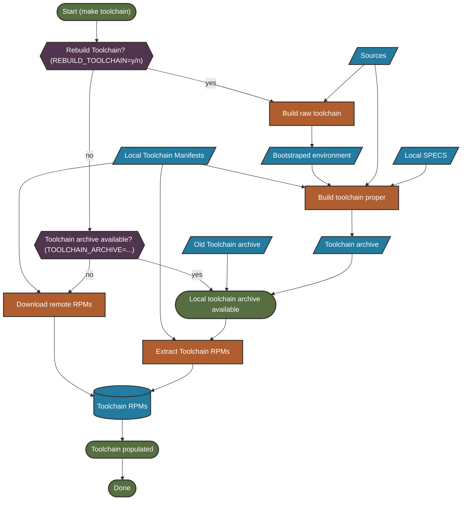

The initial preparation phase sets up all the infrastructure needed for building packages. This includes the Make-based build system, the toolchain RPMs, chroot workers, and the Go tools that orchestrate the build process.

## The Makefile System

The build system uses **Make** as its foundation. Make is ideal for tracking hierarchical dependencies and determining what needs rebuilding based on file modification times.

### Makefile Organization

The make scripts are split across multiple `*.mk` files in `./scripts`, each focused on a specific purpose:

- `tools.mk` - Go tool building and management
- `utils.mk` - Common utilities and variable tracking
- `packages.mk` - Package building logic
- `images.mk` - Image generation logic

<Tip>
For a complete list of available Make targets, see the [Building Azure Linux](/building/overview) guide.
</Tip>

## Toolchain

To guarantee reliable, reproducible builds, all packages are built using a standardized toolchain published as RPMs. These toolchain RPMs create a chroot environment that mimics the final OS.

### Toolchain Build Flow



### Toolchain Modes

<Tabs>
  <Tab title="Download (Default)">
    **Fastest option** - Downloads pre-built toolchain RPMs from remote servers
    ```bash
    make toolchain
    ```
  </Tab>
  <Tab title="From Archive">
    Extracts toolchain from a local archive file
    ```bash
    make toolchain TOOLCHAIN_ARCHIVE=toolchain.tar.gz
    ```
  </Tab>
  <Tab title="Full Bootstrap">
    **Complete rebuild** - Builds toolchain from scratch using Docker
    ```bash
    make toolchain REBUILD_TOOLCHAIN=y
    ```
    This performs a two-stage bootstrap:
    1. Uses host tools to build intermediate toolchain RPMs in Docker
    2. Uses intermediate RPMs to build clean final toolchain RPMs
  </Tab>
</Tabs>

## Chroot Worker

The chroot worker is an archive containing all toolchain RPMs installed into a clean chroot environment. This archive can be extracted and entered via `chroot` to access only the RPM-based tools and filesystem.

### Primary Uses

The chroot worker is used at several critical points:

<Steps>
  <Step title="Processing Spec Files">
    Uses Azure Linux's RPM macros to parse and evaluate spec files
  </Step>
  <Step title="Package Management">
    Runs `tdnf` to download and manage packages
  </Step>
  <Step title="Building Packages">
    Provides isolated build environment with only toolchain compilers and tools
  </Step>
</Steps>

### How It Works

<Accordion title="Chroot Mechanism Details">
The change root (`chroot`) operation instructs the kernel to enter a folder and reset the root directory (`/`) to that location. This completely swaps the environment to one rooted in the selected folder, isolating the build from host tools and filesystem.

**Key Points:**
- Initially empty—must be seeded with utilities and filesystem
- Uses `rpm --root` to install packages from outside the environment
- Requires mounting system resources (`/dev`, `/proc`, `/sys`) for some operations
- **Critical**: Must unmount these directories before cleanup to avoid host system issues

The Go tools utilize the `safechroot` package to handle chroot operations, ensuring safe cleanup even during errors.
</Accordion>

<Warning>
If you see `bash: /dev/null: Permission denied`, an unmount likely failed. **Reboot the host machine** to resolve this issue.
</Warning>

## Go Tools

The build system includes a suite of Go tools that handle various aspects of the build process. These tools can be rebuilt with:

```bash
make go-tools REBUILD_TOOLS=y
```

### Core Go Tools

<AccordionGroup>
  <Accordion title="Package Building Tools">
    - **specreader** - Scans spec files and extracts dependency information into JSON
    - **srpmpacker** - Creates source RPMs from specs and sources (local or downloaded)
    - **grapher** - Creates dependency graphs from parsed spec files
    - **graphpkgfetcher** - Resolves unresolved dependencies by finding or downloading RPMs
    - **scheduler** - Orchestrates parallel package builds based on dependency graph
    - **pkgworker** - Builds individual packages in isolated chroot environments
    - **graphanalytics** - Analyzes dependency graphs and identifies blocking packages
  </Accordion>
  
  <Accordion title="Image Generation Tools">
    - **imageconfigvalidator** - Validates image configuration files
    - **imagepkgfetcher** - Finds all packages needed for image composition
    - **imager** - Composes images: creates partitions, installs packages, configures users
    - **roast** - Converts raw images to final formats (VHD, VHDX, etc.)
    - **isomaker** - Creates bootable ISO installers
    - **liveinstaller** - Runs inside ISO initrd to install images to new computers
  </Accordion>
  
  <Accordion title="Utility Tools">
    - **depsearch** - Lists all packages depending on a given set of packages
    - **validatechroot** - Verifies chroot has all dependencies correctly installed
    - **licensechecker** - Validates licensing files in RPM packages
    - **bldtracker** - Records timestamps during image building for shell scripts
    - **boilerplate** - Sample tool demonstrating argument parsing and logging
  </Accordion>
</AccordionGroup>

### Tool Architecture

Each Go tool:
- Has a `--help` argument listing all available options
- Runs self-tests automatically when built (if test files exist)
- Shares common libraries from `./tools/internal/`
- Tracks external dependencies via `./tools/go.mod` and `./tools/go.sum`

<Info>
Run `make go-test-coverage` to manually execute all self-tests and generate an HTML coverage report at `./../out/tools/test_coverage_report.html`.
</Info>

## Advanced Makefile Patterns

The build system uses several advanced Make patterns to handle complex dependencies:

<Accordion title="Config Tracking">
Configuration variables that affect the build are tracked as dependencies. The system stores variable values in status files and triggers rebuilds when values change.

**Example**: `PACKAGE_BUILD_LIST` affects the package build workplan. When changed, dependent components automatically rebuild.

**Implementation**: Uses meta-programming with the `depend_on_var` define to create tracking flags for each monitored variable.
</Accordion>

<Accordion title="Folder Dependencies">
Make doesn't track folder contents well—only the folder's modification time. The build system uses a two-part process:

1. **Flag file** - Contains actual logic and updates only on success
2. **Folder target** - Simply touches the folder, depending on the flag file

This ensures partial failures are detected and trigger rebuilds on the next run.
</Accordion>

<Accordion title="Go Tool Compilation">
Go tools are dynamically compiled based on the `$(go_tool_list)` variable. For each tool:
- Variables created: `$(go-toolname)` to reference the tool
- Phony targets: `go-toolname` to manually build
- Dependencies: All `*.go` files in the tool's directory plus common files

Shared files (`./tools/internal/*`, `go.mod`, `go.sum`) trigger rebuilds of all tools when changed.
</Accordion>

## Next Steps

<CardGroup cols={2}>
  <Card title="Local Packages" icon="arrow-right" href="./local-packages">
    Learn how spec files are converted to source RPMs
  </Card>
  <Card title="Build System Overview" icon="arrow-left" href="./build-system">
    Return to the architecture overview
  </Card>
</CardGroup>
