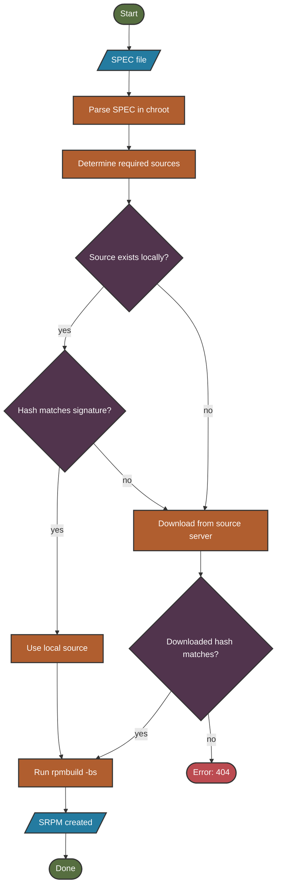

Local packages are the foundation of an Azure Linux build. This page explains how spec files are organized, how source files are managed, and how they're packaged into source RPMs (SRPMs) with cryptographic verification.

## Repository Structure

An Azure Linux repository typically consists of:

<CardGroup cols={3}>
  <Card title="SPECS Directory" icon="folder-tree">
    Root directory (`$(SPEC_DIR)`) with subdirectories for each package
  </Card>
  <Card title="Image Configs" icon="file-code">
    Configuration files (`$(CONFIG_FILE)`) defining target images
  </Card>
  <Card title="Toolkit" icon="toolbox">
    Build system tools and makefiles
  </Card>
</CardGroup>

### SPECS Directory Layout

Each package has its own subdirectory within the SPECS folder to avoid name collisions:

```
SPECS/
├── bash/
│   ├── bash.spec
│   ├── bash.signatures.json
│   └── bash-patches-*.patch
├── kernel/
│   ├── kernel.spec
│   ├── kernel.signatures.json
│   └── config-*
└── systemd/
    ├── systemd.spec
    ├── systemd.signatures.json
    └── systemd-*.patch
```

<Info>
Each spec file is accompanied by a `*.signatures.json` file that records expected cryptographic hashes for every source file used in the package.
</Info>

## SPEC Files

SPEC files define how packages are built. They contain:

- Package metadata (name, version, summary, license)
- Build and runtime dependencies
- Source file locations
- Build instructions
- Installation procedures
- File lists for each package/subpackage

<Tip>
The build system monitors `$(SPEC_DIR)` for changes. When spec files or sources change, all dependent files are automatically rebuilt.
</Tip>

## Creating SRPMs

The build system operates on **Source RPMs** (SRPMs). An SRPM includes both:
- The spec file defining the package
- All associated source files (archives, patches, configs, etc.)

### SRPM Creation Process



### The srpmpacker Tool

The `srpmpacker` tool converts spec files into SRPMs by:

<Steps>
  <Step title="Parse Spec File">
    Runs inside the chroot worker to support RPM macros
  </Step>
  <Step title="Identify Sources">
    Determines which source files are needed
  </Step>
  <Step title="Verify Local Sources">
    Checks if sources exist locally and match the signature hash
  </Step>
  <Step title="Download Missing Sources">
    Fetches from source server if not found locally or hash mismatch
  </Step>
  <Step title="Build SRPM">
    Calls `rpmbuild -bs` to create the source RPM
  </Step>
</Steps>

<Warning>
`srpmpacker` will only accept source files that match the hash in the `*.signatures.json` file. If a local file's hash doesn't match, the tool attempts to download a matching file from the source server.
</Warning>

## File Signature Handling

Hash checking behavior is controlled by `$(SRPM_FILE_SIGNATURE_HANDLING)`:

<Tabs>
  <Tab title="enforce (default)">
    **Most secure** - Only packages source files matching the listed hash
    
    - Validates all source files against signatures
    - Downloads missing files from online package server
    - Build fails if hashes don't match
    
    ```bash
    make input-srpms SRPM_FILE_SIGNATURE_HANDLING=enforce
    ```
  </Tab>
  
  <Tab title="skip">
    **Development mode** - Disables hash validation
    
    - Accepts any file with a matching name
    - Useful for rapid iteration during development
    - **Not recommended for production builds**
    
    ```bash
    make input-srpms SRPM_FILE_SIGNATURE_HANDLING=skip
    ```
  </Tab>
  
  <Tab title="update">
    **Signature generation** - Updates signatures for local sources
    
    - Adds hashes for local source files to `*.signatures.json`
    - Useful when adding new source files to specs
    - Automatically maintains signature files
    
    ```bash
    make input-srpms SRPM_FILE_SIGNATURE_HANDLING=update
    ```
  </Tab>
</Tabs>

## Intermediate Build Artifacts

### Intermediate SRPMs

Once `srpmpacker` determines a spec needs re-packaging, it generates an SRPM in:

```
./../build/INTERMEDIATE_SRPMS/<arch>/
```

Build these manually with:

```bash
make input-srpms
```

### Intermediate SPECs

Canonical copies of spec files are extracted from SRPMs for dependency analysis:

```
./../build/INTERMEDIATE_SPECS/<package>-<version>/
```

Extract these manually with:

```bash
make expand-specs
```

<Info>
These intermediate specs are used by the `specreader` tool to calculate dependency information without reparsing the original files.
</Info>

## Build Optimization

The scheduler will skip rebuilding a package if it determines the package is up-to-date. This check includes:

- Spec file modification time
- Source file modification times  
- Signature file changes
- Dependency changes

<Accordion title="Working on Individual Packages">
When iterating on a single package, you may need to force a rebuild even when the build system thinks it's up-to-date. See the [Package Stage](/building/package-stage) guide for tips on:

- Forcing rebuilds of specific packages
- Clearing cached build state
- Bypassing up-to-date checks during development
</Accordion>

## Source Server Integration

When local sources are missing or have mismatched hashes, `srpmpacker` queries the source server to download matching files.

### Source Server Behavior

- Downloads are verified against the signature hash
- Only sources with matching hashes are accepted
- If no matching source is found, build fails with `404 error`
- Downloaded sources are cached for future builds

```bash
# Example error when source is not found
ERROR: Failed to download source file 'example-1.0.0.tar.gz'
ERROR: No matching hash found on source server
ERROR: Expected hash: sha256:abc123...
```

## Signature File Format

The `*.signatures.json` file contains hashes for all sources:

```json
{
  "Signatures": {
    "example-1.0.0.tar.gz": "sha256:abc123...",
    "fix-build.patch": "sha256:def456...",
    "config-file.conf": "sha256:ghi789..."
  }
}
```

<Tip>
Use `SRPM_FILE_SIGNATURE_HANDLING=update` to automatically generate or update signature files when adding new sources to your spec files.
</Tip>

## Next Steps

<CardGroup cols={2}>
  <Card title="Package Building" icon="arrow-right" href="./package-building">
    Learn how SRPMs are built into RPMs with dependency resolution
  </Card>
  <Card title="Initial Preparation" icon="arrow-left" href="./initial-prep">
    Return to the initial preparation phase
  </Card>
</CardGroup>
