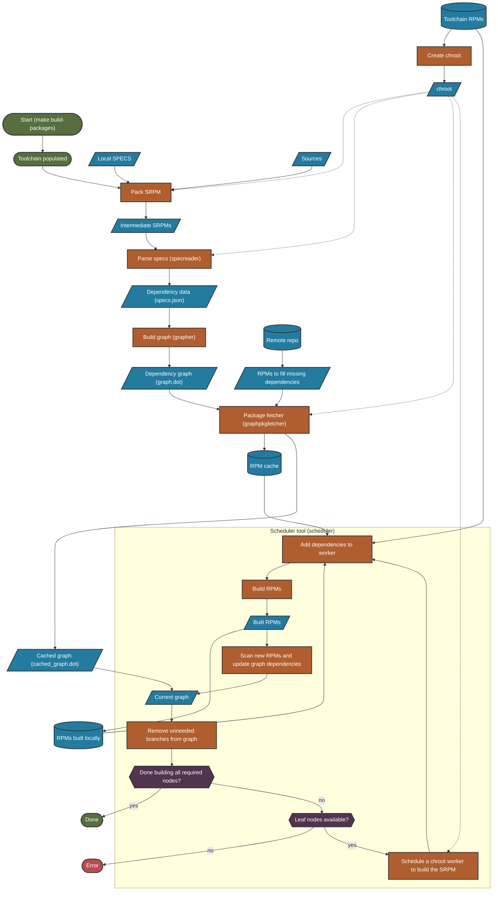

Package building is the most complex phase of the Azure Linux build system. It involves parsing dependencies, creating dependency graphs, resolving unmet dependencies, and orchestrating parallel builds across multiple workers.

## Build Process Overview

The package building process consists of five stages:

<Steps>
  <Step title="Dependency Extraction (specreader)">
    Parse all spec files and extract dependency information
  </Step>
  <Step title="Graph Generation (grapher)">
    Convert dependencies into a directed acyclic graph (DAG)
  </Step>
  <Step title="Dependency Resolution (graphpkgfetcher)">
    Resolve unmet dependencies from local cache or remote repos
  </Step>
  <Step title="Build Scheduling (scheduler)">
    Orchestrate parallel builds respecting dependency order
  </Step>
  <Step title="Package Building (pkgworker)">
    Build individual packages in isolated chroot environments
  </Step>
</Steps>

## Complete Package Build Flow



## Stage 1: Dependency Extraction

The `specreader` tool scans intermediate spec files and extracts dependency information using `rpmspec -q` inside the chroot worker.

### What Gets Extracted

For each package in a spec file:

- **Provides** - Package name(s), version, and virtual packages
- **BuildRequires** - Packages needed to build (shared across all subpackages)
- **Requires** - Packages needed at runtime (per subpackage)

### Example Output

A simple spec might produce:

```json
{
  "Provides": {
    "Name": "example",
    "Version": "1.0.0-1.cm1",
    "Condition": "="
  },
  "SrpmPath": "build/INTERMEDIATE_SRPMS/x86_64/example-1.0.0-1.cm1.src.rpm",
  "RpmPath": "out/RPMS/x86_64/example-1.0.0-1.x86_64.cm1.rpm",
  "SpecPath": "build/INTERMEDIATE_SPECS/example-1.0.0-1.cm1/example.spec",
  "Architecture": "x86_64",
  "Requires": [
    {
      "Name": "nano",
      "Version": "",
      "Condition": ""
    }
  ],
  "BuildRequires": null
}
```

Output location: `./../build/pkg_artifacts/specs.json`

### Rich Dependencies

Spec files can use complex requirement expressions:

<Tabs>
  <Tab title="Supported">
    **and, or, with** - Both options recorded, allowing maximum flexibility during install
    
    ```spec
    Requires: (foo or bar)
    ```
    All optional RPMs must be available, even if not used for a specific configuration.
  </Tab>
  
  <Tab title="Partial Support">
    **if** - Left side of clause recorded as dependency
    
    ```spec
    Requires: (foo if bar)
    ```
    The `foo` package will be required/downloaded even if not needed.
  </Tab>
  
  <Tab title="Unsupported">
    **else, unless, without** - Build fails with error
    
    Multiple clauses of any kind are also unsupported.
  </Tab>
</Tabs>

<Warning>
The build system prints warnings for rich dependencies. If the build fails, ensure all conditional packages follow the guidelines or remove unavailable packages from the spec.
</Warning>

## Stage 2: Dependency Graphing

The `grapher` tool converts `specs.json` into a directed acyclic graph (DAG) representing package dependencies.

### Graph Node Types

<AccordionGroup>
  <Accordion title="TypeLocalBuild - Build Nodes">
    Represents a local package that can be built
    
    **States:**
    - `StateBuild` - Should be built
    - `StateBuildError` - Dependencies satisfied but build failed
    - `StateUpToDate` - Package already available locally
  </Accordion>
  
  <Accordion title="TypeLocalRun - Run Nodes">
    Represents a package that can be installed or used as a dependency
    
    **States:**
    - `StateMeta` - Organizational node for imposing ordering
  </Accordion>
  
  <Accordion title="TypeRemoteRun - Remote Nodes">
    Unknown package needed as a dependency, must be resolved remotely
    
    **States:**
    - `StateUnresolved` - No source found yet
    - `StateCached` - Remote source found and package cached locally
  </Accordion>
  
  <Accordion title="TypeGoal - Goal Nodes">
    Special node grouping packages together
    
    **States:**
    - `StateMeta` - If satisfied, all grouped packages are available
    
    The grapher automatically adds an "ALL" goal node linking to every package.
  </Accordion>
  
  <Accordion title="TypePureMeta - Pure Meta Nodes">
    Purely organizational, used to resolve intra-package cycles
    
    **States:**
    - `StateMeta` - Organizational node
  </Accordion>
</AccordionGroup>

### Graph Generation Process

<Steps>
  <Step title="Create Nodes">
    Each package gets two nodes: a `BUILD` node and a `RUN` node
  </Step>
  <Step title="Link Build to Run">
    Add edge from RUN → BUILD (can't install until built)
  </Step>
  <Step title="Add BuildRequires">
    Add edges from current BUILD → required RUN nodes
  </Step>
  <Step title="Add Requires">
    Add edges from current RUN → required RUN nodes
  </Step>
  <Step title="Resolve Cycles">
    Fix intra-package cycles using meta nodes
  </Step>
</Steps>

### Package Lookup and Versioning

Dependencies specify requirements with varying detail:

- Simple name: `Requires: example`
- Version constraint: `Requires: example >= 1.0.0`
- Double constraint: `Requires: example >= 1.0.0`, `Requires: example < 2.0.0`
- Exact version: `Requires: example = 1.0.0`

The grapher maintains sorted lookup lists and selects the **highest version** package satisfying requirements. If no match is found, an unresolved node is added.

<Info>
Versions are split into version and release components. Release numbers are only considered if both versions explicitly contain one.
</Info>

### Cycle Resolution

Circular dependencies are generally fatal errors, except for special cases:

**Solvable Cycles:**
- All nodes in cycle from the same SPEC file
- All dependencies are runtime dependencies

**Solution:** Insert a `TypePureMeta` node consolidating all cycle dependencies. Cycle nodes then depend on the meta node instead of each other.

<Accordion title="Cycle Resolution Example">
Nodes `A-a` and `A-b` are from the same spec and require each other:

**Before:**
```
A-a → B
A-a → A-b
A-b → C
A-b → A-a
```

**After (meta node ID=8):**
```
A-a → meta(8)
A-b → meta(8)
meta(8) → B
meta(8) → C
```

The meta node consolidates requirements, breaking the cycle.
</Accordion>

### Dynamic Dependencies

Some provides are only known after building. For example, `bar` may provide `pkgconfig(bar)`, but this is only known after building `bar`.

These **implicit provides** create **dynamic dependencies** that result in graphs that may not be solvable until packages are built. The scheduler handles this by analyzing built RPMs and updating the graph.

Output location: `./../build/pkg_artifacts/graph.dot`

## Stage 3: Dependency Resolution

The `graphpkgfetcher` tool resolves unresolved remote nodes by finding or downloading missing packages.

### Search Order

The tool searches five locations using `tdnf` in a chroot:

<Steps>
  <Step title="Local Chroot">
    Already installed in the worker environment
  </Step>
  <Step title="Built RPMs">
    Previously built packages in `./../out/RPMS/`
  </Step>
  <Step title="Upstream Base">
    Official Azure Linux base repository
  </Step>
  <Step title="Upstream Preview">
    Preview repository (if `USE_PREVIEW_REPO=y`)
  </Step>
  <Step title="Custom Repos">
    Any repos listed in `REPO_LIST`
  </Step>
</Steps>

<Info>
Set `DISABLE_UPSTREAM_REPOS=y` to disable all network-accessed repositories.
</Info>

### How It Works

- `tdnf` prioritizes local packages over remote downloads
- Local packages are accessed via mounted overlay in chroot
- Cached RPMs are written through a writable mount
- Local folder is converted to a repo (changes not persisted outside chroot)
- Satisfied nodes are marked as `StateCached`

Output location: `./../build/pkg_artifacts/cached_graph.dot`

## Stage 4: Build Scheduling

The `scheduler` tool orchestrates parallel package builds using a pool of `pkgworker` agents.

### Scheduling Algorithm

<Steps>
  <Step title="Start at Leaf Nodes">
    Find packages with all dependencies satisfied
  </Step>
  <Step title="Schedule Builds">
    Spawn pkgworker for each ready package
  </Step>
  <Step title="Update Graph">
    Mark built nodes complete, analyze for implicit provides
  </Step>
  <Step title="Find New Leaves">
    Identify packages newly ready to build
  </Step>
  <Step title="Repeat">
    Continue until all required packages are built
  </Step>
</Steps>

### Build Optimization

The scheduler avoids unnecessary rebuilds:

- Skips building if package already exists
- **But rebuilds if any build dependency was rebuilt**
- This ensures consistency across the build

<Tip>
The scheduler continuously optimizes the graph during the build, creating subgraphs that contain only needed packages when no dynamic dependencies are present.
</Tip>

### Dynamic Dependency Handling

When a package is built:

<Steps>
  <Step title="Analyze RPM">
    Extract implicit provides from built package
  </Step>
  <Step title="Match Dependencies">
    Find if any graph node needs this implicit provide
  </Step>
  <Step title="Update Graph">
    Modify nodes and edges to reflect new information
  </Step>
  <Step title="Attempt Subgraph">
    Try to create solvable subgraph with complete info
  </Step>
</Steps>

If dynamic dependencies exist, the full graph is maintained until enough packages are built to resolve all dynamic dependencies.

Output location: `./../build/pkg_artifacts/built_graph.dot`

## Stage 5: Package Building

The `pkgworker` tool (invoked by scheduler) builds individual packages in isolated chroot environments.

### Build Process

<Steps>
  <Step title="Create Build Directory">
    Fresh empty folder for this package
  </Step>
  <Step title="Extract Chroot">
    Unpack chroot worker archive with toolchain
  </Step>
  <Step title="Mount Local RPMs">
    Make built packages accessible to worker
  </Step>
  <Step title="Install Dependencies">
    Use `tdnf` to install build dependencies
  </Step>
  <Step title="Build Package">
    Run `rpmbuild` to compile the package
  </Step>
  <Step title="Copy Output">
    Place built RPMs in `./../out/RPMS/`
  </Step>
  <Step title="Cleanup">
    Safely unmount and remove chroot (even on error)
  </Step>
</Steps>

<Warning>
Each package builds in complete isolation. The pkgworker ensures safe cleanup even if the build fails, preventing chroot mount issues.
</Warning>

## Visualizing Graphs

All graph files use GraphViz `dot` format and include human-readable information for debugging.

### View Graphs Visually

```bash
# Generate PNG visualization
dot -Tpng -o visualized.png < graph.dot

# Or use other GraphViz tools
fdp -Tsvg graph.dot > graph.svg
neato -Tpdf graph.dot > graph.pdf
```

<Info>
**Note**: Graphs for large builds are often impractically large to visualize. They're still useful for programmatic analysis or grepping for specific packages.
</Info>

### Graph Files

- `graph.dot` - Initial graph from grapher
- `cached_graph.dot` - After dependency resolution
- `built_graph.dot` - Final state after all builds

## Next Steps

<CardGroup cols={2}>
  <Card title="Image Generation" icon="arrow-right" href="/architecture/image-generation">
    Learn how packages are composed into bootable images
  </Card>
  <Card title="Local Packages" icon="arrow-left" href="/architecture/local-packages">
    Return to local package handling
  </Card>
</CardGroup>
