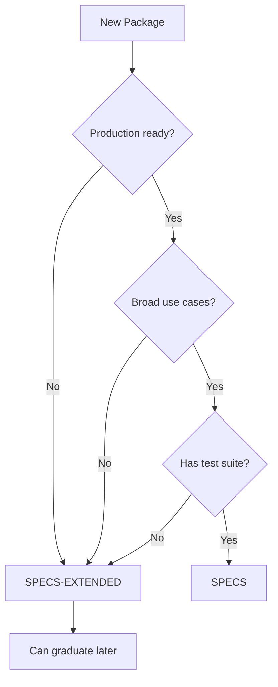

Azure Linux organizes packages into two directories with different support levels and requirements. Understanding these differences is crucial for package maintainers and contributors.

## Directory Comparison

<CardGroup cols={2}>
  <Card title="SPECS" icon="shield-check" color="#16a34a">
    Production-ready packages with full support, timely CVE patches, and quality guarantees
  </Card>
  <Card title="SPECS-EXTENDED" icon="flask-vial" color="#ea580c">
    Experimental packages for proof-of-concept, testing, and staging before promotion
  </Card>
</CardGroup>

## Detailed Comparison

| Feature | SPECS | SPECS-EXTENDED |
|---------|-------|----------------|
| **Published** | ✅ Yes | ✅ Yes |
| **Supported** | ✅ Yes | ❌ No |
| **CVE Maintenance** | Timely patches required | Best effort only |
| **Quality Requirements** | Strict | Relaxed |
| **Use Cases** | Production systems | Development, experimentation |
| **Viable Upstream** | ✅ Required | ✅ Required |
| **Project-Specific Code** | ❌ Not allowed | ❌ Not allowed |
| **Multiple Use Cases** | ✅ Required | Not required |

## SPECS Directory

The `SPECS` directory contains packages that meet Azure Linux's production quality standards.

### Requirements

<AccordionGroup>
  <Accordion title="Viable Upstream Source">
    The package must have an active upstream project that:
    - Regularly releases security updates
    - Actively addresses CVE reports
    - Maintains source code availability
    - Provides reasonable support for users
  </Accordion>

  <Accordion title="No Project-Specific Code">
    Packages must be general-purpose software, not custom code for specific projects or organizations. This ensures broad applicability.
  </Accordion>

  <Accordion title="Multiple Use Case Value">
    The package should provide value across different scenarios and user groups, not just a single narrow use case.
  </Accordion>

  <Accordion title="Test Coverage">
    Packages must include a `%check` section in the SPEC file that validates functionality during builds.
  </Accordion>
</AccordionGroup>

### Example Packages

<CodeGroup>
```bash SPECS Examples
SPECS/
├── curl/          # HTTP client library - widely used
├── nginx/         # Web server - production workloads
├── python3/       # Programming language - broad utility
├── openssl/       # Cryptography library - core dependency
└── systemd/       # Init system - system critical
```
</CodeGroup>

## SPECS-EXTENDED Directory

The `SPECS-EXTENDED` directory serves as a staging area and experimental zone for packages.

### Use Cases

<CardGroup cols={2}>
  <Card title="New Package Testing" icon="vial">
    Test new packages before promoting to SPECS
  </Card>
  <Card title="Experimental Features" icon="flask">
    Try cutting-edge versions or experimental builds
  </Card>
  <Card title="Niche Software" icon="puzzle-piece">
    Packages useful for specific scenarios
  </Card>
  <Card title="Development Tools" icon="code">
    Tools needed for development but not production
  </Card>
</CardGroup>

### Requirements

<Check>Viable upstream source with active CVE management</Check>
<Check>No project-specific code</Check>
<Warning>No guarantee of CVE patching timeline</Warning>
<Warning>May be removed without notice if inactive</Warning>

### Example Packages

<CodeGroup>
```bash SPECS-EXTENDED Examples
SPECS-EXTENDED/
├── 389-ds-base/      # LDAP server - specialized use
├── CharLS/           # JPEG-LS library - niche codec
├── GeoIP/            # IP geolocation - specific feature
└── PEGTL/            # Parser library - development tool
```
</CodeGroup>

## Package Graduation Process

Packages can be promoted from SPECS-EXTENDED to SPECS when they demonstrate value and meet requirements.

<Steps>
  <Step title="File a GitHub Issue">
    Create an issue explaining the package's value and broader use cases
  </Step>
  <Step title="Increment Release Version">
    Update the `Release` field in the SPEC file
  </Step>
  <Step title="Add Changelog Entries">
    Document the promotion with these entries:
    - "Package promoted from SPECS-EXTENDED to SPECS"
    - "License verified"
  </Step>
  <Step title="Add or Verify Tests">
    Ensure a comprehensive `%check` section exists and passes
  </Step>
  <Step title="Clean Up SPEC File">
    Remove references, macros, or comments specific to other distributions
  </Step>
  <Step title="Submit Pull Request">
    Create PR with graduation changes and complete the PR checklist
  </Step>
  <Step title="Pass GitHub Checks">
    All automated checks must pass before merge
  </Step>
</Steps>

### Example Graduation PR Changes

<Tabs>
  <Tab title="SPEC File Changes">
    ```diff
    Summary:        Example package description
    Name:           example-package
    Version:        1.2.3
    -Release:        1%{?dist}
    +Release:        2%{?dist}
    License:        MIT
    
    %changelog
    +* Mon Feb 20 2026 Your Name <you@microsoft.com> - 1.2.3-2
    +- Package promoted from SPECS-EXTENDED to SPECS
    +- License verified
    +
    * Fri Jan 15 2026 Original Author <author@microsoft.com> - 1.2.3-1
    - Initial package
    ```
  </Tab>
  
  <Tab title="Directory Move">
    ```bash
    # Move package from SPECS-EXTENDED to SPECS
    git mv SPECS-EXTENDED/example-package SPECS/example-package
    
    # Update any references in build manifests
    # Edit toolkit/resources/manifests/package/*.txt if needed
    ```
  </Tab>
  
  <Tab title="Test Addition">
    ```diff
    %install
    %make_install
    find %{buildroot} -type f -name "*.la" -delete -print
    
    +%check
    +make test
    +
    %files
    %defattr(-,root,root)
    %license LICENSE
    ```
  </Tab>
</Tabs>

## Choosing the Right Directory

Use this decision tree to determine where your package belongs:



<Info>
**Start in SPECS-EXTENDED** if you're unsure. You can always graduate packages later after proving their value and stability.
</Info>

## Best Practices

<CardGroup cols={2}>
  <Card title="For SPECS Packages" icon="shield-check">
    - Monitor CVE databases regularly
    - Keep patches up-to-date
    - Maintain comprehensive tests
    - Document all changes thoroughly
  </Card>
  
  <Card title="For SPECS-EXTENDED Packages" icon="flask-vial">
    - Mark experimental status clearly
    - Document known limitations
    - Track graduation criteria
    - Keep upstream in sync
  </Card>
</CardGroup>

## Common Questions

<AccordionGroup>
  <Accordion title="Can I use SPECS-EXTENDED packages in production?">
    While SPECS-EXTENDED packages are published and installable, they are **not recommended for production use** because they lack guaranteed CVE support and may have stability issues.
  </Accordion>

  <Accordion title="How long does graduation take?">
    Graduation timeline depends on:
    - Complexity of the package
    - Quality of test coverage
    - Review team availability
    - Community feedback
    
    Expect 2-4 weeks for most packages.
  </Accordion>

  <Accordion title="What happens if a SPECS package loses upstream support?">
    If upstream becomes inactive or stops addressing CVEs, the package may be:
    - Moved to SPECS-EXTENDED
    - Replaced with an alternative
    - Removed entirely (with advance notice)
  </Accordion>

  <Accordion title="Can packages move from SPECS to SPECS-EXTENDED?">
    Yes, packages can be demoted if they:
    - Lose active upstream maintenance
    - No longer provide broad value
    - Have persistent quality issues
    - Are replaced by better alternatives
  </Accordion>
</AccordionGroup>

## Next Steps

<CardGroup cols={2}>
  <Card title="Creating SPEC Files" icon="file-code" href="/packages/creating-spec-files">
    Learn how to write RPM SPEC files for both directories
  </Card>
  <Card title="Package Repository" icon="database" href="/packages/package-repository">
    Understand the repository structure and organization
  </Card>
</CardGroup>
